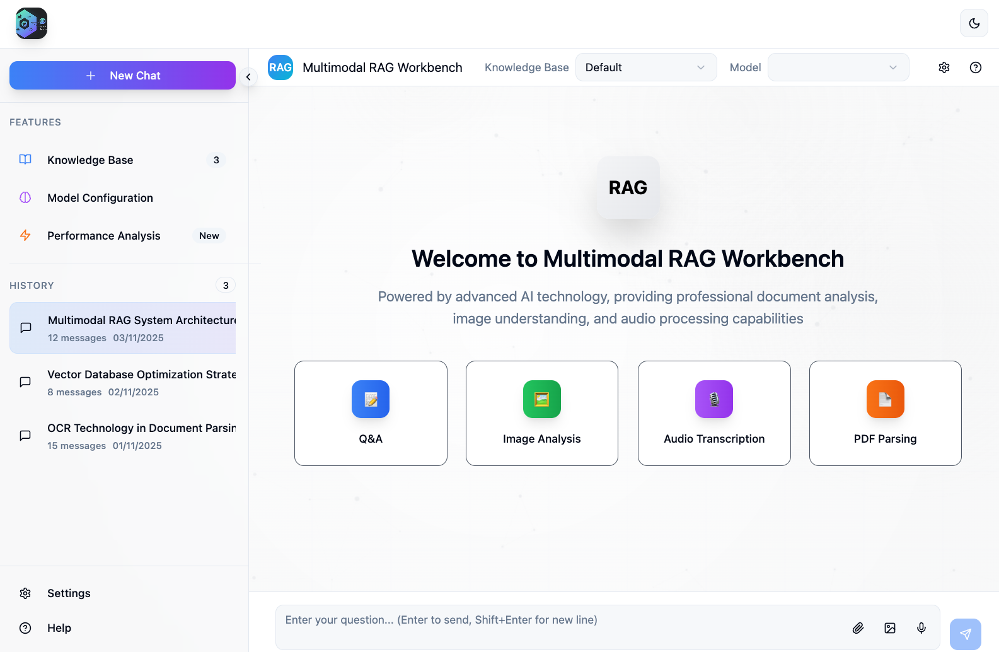

# Multimodal RAG Workbench

[](https://www.python.org/downloads/)
[](https://nodejs.org/)
[](LICENSE)
[](https://fastapi.tiangolo.com/)
[](https://reactjs.org/)
[](https://www.langchain.com/)

> A powerful multimodal Retrieval-Augmented Generation (RAG) workbench that combines document processing, image understanding, and audio transcription with intelligent conversation capabilities.

[🎯 Features](#features) • [🚀 Quick Start](#quick-start) • [📚 Documentation](#api-documentation) • [🛠️ Development](#development) • [🤝 Contributing](#contributing)

---

## Overview



The Multimodal RAG Workbench is a full-stack application designed for educational demonstrations, research experiments, and production-ready deployments. It leverages cutting-edge AI models from OpenAI (GPT-4O, GPT-5, Whisper) with LangChain 1.0 to provide:

- **Multimodal Understanding**: Process and understand PDFs, images, audio, and video files
- **Intelligent Citations**: Automatic reference extraction with clickable source citations
- **Real-time Streaming**: Smooth streaming responses using Server-Sent Events (SSE)
- **OCR Processing**: High-resolution PDF text extraction with Tesseract OCR
- **Audio Transcription**: Speech-to-text conversion via OpenAI Whisper
- **Modern UI**: Beautiful React interface with shadcn/ui components and dark mode

### Technology Stack

**Backend:**
- FastAPI + Uvicorn (async web framework)
- LangChain 1.0 (AI orchestration)
- Unstructured.io (document processing)
- OpenAI API (GPT-4O, GPT-5, Whisper)
- PyMuPDF + Tesseract (OCR)

**Frontend:**
- React 18 + TypeScript
- Vite (build tool)
- Tailwind CSS + shadcn/ui
- Framer Motion (animations)
- react-markdown (rich text rendering)

---

## Features

### 🎯 Multimodal Content Processing

- **📄 PDF Processing**: OCR-enabled document parsing with intelligent chunking and table inference
- **🖼️ Image Understanding**: Direct vision model integration for image analysis
- **🎤 Audio Transcription**: Support for MP3, WAV, FLAC, M4A, OGG formats
- **🎬 Video Processing**: Automatic audio extraction from MP4, AVI, MOV, MKV, WebM

### 🤖 AI Model Integration

- **GPT-4O**: Advanced multimodal understanding (text + vision)
- **GPT-4O Mini**: Lightweight version for faster responses
- **GPT-5**: Next-generation model support (when available)
- **Whisper**: State-of-the-art speech recognition

### 📚 Intelligent Reference System

- Automatic citation extraction from AI responses
- Source-to-response linking with `[1]`, `[2]` markers
- Clickable reference superscripts
- Reference drawer with full source context

### ⚡ Real-time Features

- Server-Sent Events (SSE) streaming
- Live PDF processing progress (5-stage pipeline)
- Real-time transcription status updates
- Auto-scrolling chat interface

### 🎨 Modern User Interface

- 50+ shadcn/ui components
- Dark mode support with next-themes
- Particle animation background
- Responsive design
- Conversation history management
- Markdown rendering with syntax highlighting

---

## Architecture

### System Architecture

```
┌────────────────────────────────────────────────────────────┐
│                   Frontend (React + Vite)                  │
│  ┌─────────────────────────────────────────────────────┐   │
│  │  Components: MessageBubble, InputBar, References    │   │
│  │  State: Messages, Streaming, Multimodal Content     │   │
│  │  API Client: chat.ts (SSE streaming)                │   │
│  └──────────────────────┬──────────────────────────────┘   │
└─────────────────────────┼──────────────────────────────────┘
                          │ HTTP/SSE
                          │ localhost:5173 → localhost:8000
┌─────────────────────────▼──────────────────────────────────┐
│                   Backend (FastAPI)                        │
│  ┌─────────────────────────────────────────────────────┐   │
│  │  Endpoints: /api/chat/stream, /api/pdf/process      │   │
│  │  Processors: pdf_processor, audio_processor         │   │
│  │  AI: LangChain + OpenAI (GPT-4O, Whisper)           │   │
│  └──────────────────────┬──────────────────────────────┘   │
└─────────────────────────┼──────────────────────────────────┘
                          │
            ┌─────────────┼─────────────┐
            │             │             │
    ┌───────▼───────┐ ┌───▼───────┐ ┌───▼────────┐
    │ OpenAI API    │ │ Tesseract │ │ FFmpeg     │
    │ (GPT/Whisper) │ │ (OCR)     │ │ (Audio)    │
    └───────────────┘ └───────────┘ └────────────┘
```

### Message Flow

1. **User Input**: Text + optional files (images/PDFs/audio)
2. **File Processing**:
   - PDFs → Unstructured.io → OCR → Chunking → Reference IDs
   - Audio → FFmpeg → Whisper API → Transcription
   - Images → Base64 encoding
3. **Request Formation**: `MessageRequest` with `content_blocks` + `pdf_chunks`
4. **LangChain Processing**: Convert to multimodal messages
5. **Context Injection**: If PDFs exist, inject chunks with `[1]`, `[2]` markers
6. **Model Streaming**: GPT-4O generates response via SSE
7. **Reference Extraction**: Regex pattern `\[(\d+)\]` extracts citations
8. **Frontend Display**: Render message with clickable reference superscripts

---

## Quick Start

### Prerequisites

**System Requirements:**
- Python 3.8 or higher
- Node.js 16 or higher
- Tesseract OCR: `brew install tesseract` (macOS) or [see installation guide](https://tesseract-ocr.github.io/tessdoc/Installation.html)
- FFmpeg: `brew install ffmpeg` (macOS) or [see installation guide](https://ffmpeg.org/download.html)

**API Keys:**
- OpenAI API key ([get one here](https://platform.openai.com/api-keys))

### Installation

#### 1. Clone the Repository

```bash
git clone <repository-url>
cd ocr_rag
```

#### 2. Backend Setup

```bash
cd backend
pip install -r requirements.txt
```

**⚠️ SECURITY WARNING**: Configure your OpenAI API key in `backend/env_config.py`:

```python
os.environ["OPENAI_API_KEY"] = "your_actual_api_key_here"
```

> **Best Practice**: Use environment variables instead of hardcoding API keys. Create a `.env` file in the backend directory and load it with `python-dotenv`:
> ```bash
> # .env
> OPENAI_API_KEY=sk-your-key-here
> OPENAI_BASE_URL=https://api.openai.com/v1
> ```

#### 3. Frontend Setup

```bash
# From project root
npm install
```

#### 4. Start the Application

**Terminal 1 - Backend:**
```bash
cd backend
python start.py
```
Backend will start at `http://localhost:8000`

**Terminal 2 - Frontend:**
```bash
npm run dev
```
Frontend will start at `http://localhost:5173`

#### 5. Open in Browser

Navigate to `http://localhost:5173` and start chatting!

---

## API Documentation

### Core Endpoints

#### 1. Streaming Chat

**Endpoint:** `POST /api/chat/stream`

**Request:**
```json
{
  "content": "Explain this document",
  "content_blocks": [
    {
      "type": "text",
      "content": "User message"
    },
    {
      "type": "image",
      "content": "data:image/jpeg;base64,/9j/4AAQ...",
      "thumbnail": "data:image/jpeg;base64,..."
    }
  ],
  "pdf_chunks": [
    {
      "content": "Document text content...",
      "metadata": {
        "source": "document.pdf",
        "page": 1,
        "reference_id": 1
      }
    }
  ],
  "history": [],
  "model": "gpt-4o",
  "knowledge_base": "default"
}
```

**Response (SSE):**
```
data: {"type": "content_delta", "content": "Based on ", "timestamp": "2025-11-04T..."}
data: {"type": "content_delta", "content": "the document [1]", "timestamp": "2025-11-04T..."}
data: {"type": "message_complete", "full_content": "Based on the document [1]...", "references": [1]}
```

#### 2. PDF Processing

**Endpoint:** `POST /api/pdf/process`

**Request:**
```json
{
  "file_data": "base64_encoded_pdf_data",
  "filename": "document.pdf"
}
```

**Response (SSE Stream):**
```
data: {"type": "progress", "stage": "saving", "message": "Saving PDF file..."}
data: {"type": "progress", "stage": "loading", "message": "Loading document..."}
data: {"type": "progress", "stage": "splitting", "message": "Splitting into chunks..."}
data: {"type": "progress", "stage": "building", "message": "Building document chunks..."}
data: {"type": "complete", "chunks": [...], "message": "Processing complete"}
```

#### 3. Audio Transcription

**Endpoint:** `POST /api/audio/process`

**Request:**
```json
{
  "file_data": "base64_encoded_audio_data",
  "filename": "recording.mp3"
}
```

**Response:**
```json
{
  "transcription": "Transcribed text from audio...",
  "filename": "recording.mp3"
}
```

#### 4. Utility Endpoints

- **Health Check:** `GET /`
- **Model List:** `GET /api/models` → Returns available models
- **Knowledge Bases:** `GET /api/knowledge-bases` → Returns knowledge base list

### Interactive API Docs

Visit `http://localhost:8000/docs` for interactive Swagger UI documentation.

---

## Configuration

### Environment Variables

Create a `.env` file in the `backend/` directory (recommended):

| Variable | Description | Default |
|----------|-------------|---------|
| `OPENAI_API_KEY` | OpenAI API key (required) | None |
| `OPENAI_BASE_URL` | OpenAI API base URL | `https://api.openai.com/v1` |
| `HOST` | Server host | `localhost` |
| `PORT` | Server port | `8000` |
| `DEBUG` | Debug mode | `False` |
| `LOG_LEVEL` | Logging level | `INFO` |

### Supported Models

- `gpt-4o` - GPT-4 optimized version with vision capabilities
- `gpt-4o-mini` - Lightweight version for faster responses
- `gpt-5` - Next-generation model (if available in your API access)

### CORS Configuration

The backend is pre-configured for local development with these origins:
- `http://localhost:5173` (Vite dev server)
- `http://localhost:3000` (alternative frontend port)

Modify `backend/config.py` to add additional origins for production deployments.

---

## Project Structure

```
ocr_rag/
├── backend/                    # Python FastAPI backend
│   ├── main.py                # Main API server with endpoints
│   ├── pdf_processor.py       # PDF processing with Unstructured.io
│   ├── audio_processor.py     # Audio transcription with Whisper
│   ├── config.py              # Pydantic settings management
│   ├── env_config.py          # Environment configuration
│   ├── start.py               # Startup script with checks
│   ├── test_client.py         # Test client for API testing
│   ├── requirements.txt       # Python dependencies
│   └── README.md              # Backend documentation
├── src/                        # React TypeScript frontend
│   ├── App.tsx                # Main application component
│   ├── main.tsx               # Application entry point
│   ├── components/            # React components
│   │   ├── ui/                # shadcn/ui component library (50+)
│   │   ├── NavigationBar.tsx  # Navigation bar
│   │   ├── Sidebar.tsx        # Sidebar (conversations)
│   │   ├── TopBar.tsx         # Top bar (model selector)
│   │   ├── MessageBubble.tsx  # Message bubble (multimodal)
│   │   ├── InputBar.tsx       # Input bar with file upload
│   │   ├── ReferenceDrawer.tsx # Reference drawer
│   │   ├── TopProgressBar.tsx  # PDF progress bar
│   │   └── LogDrawer.tsx       # Log viewer drawer
│   ├── api/
│   │   └── chat.ts            # API client with SSE support
│   └── lib/
│       └── utils.ts           # Utility functions
├── dist/                       # Production build output
├── logs/                       # Application logs
├── package.json               # Node.js dependencies
├── vite.config.ts             # Vite configuration
├── tailwind.config.js         # Tailwind CSS config
├── CLAUDE.md                  # Detailed development guide
└── README.md                  # This file
```

---

## Development

### Backend Development

```bash
cd backend

# Install dependencies
pip install -r requirements.txt

# Run development server
python start.py

# Run test client
python test_client.py

# Check logs
tail -f logs/app.log
```

### Frontend Development

```bash
# Install dependencies
npm install

# Start dev server with hot reload
npm run dev

# Build for production
npm run build

# Preview production build
npm run preview

# Lint TypeScript files
npm run lint
```

### Testing

**Backend Testing:**
```bash
cd backend
python test_client.py  # Tests streaming chat endpoint
```

**Frontend Testing:**
- Manual testing via browser at `http://localhost:5173`
- Test multimodal content: upload PDFs, images, audio files
- Test streaming responses and reference system

### Code Organization Notes

- **TypeScript Strict Mode**: Enabled for type safety
- **Path Alias**: `@` maps to `./src` directory
- **Component Library**: Uses shadcn/ui (50+ Radix UI components)
- **Component Naming**: React components use descriptive English names (e.g., `NavigationBar.tsx`, `MessageBubble.tsx`)

---

## Security Best Practices

### API Key Management

**❌ DON'T:** Hardcode API keys in `env_config.py`
```python
# BAD - Don't do this in production
os.environ["OPENAI_API_KEY"] = "sk-..."
```

**✅ DO:** Use environment variables with `.env` files
```bash
# Create .env file in backend/
echo "OPENAI_API_KEY=sk-your-key-here" > backend/.env
echo "backend/.env" >> .gitignore
```

```python
# In env_config.py or config.py
from dotenv import load_dotenv
load_dotenv()

import os
api_key = os.getenv("OPENAI_API_KEY")
```

### Production Deployment Checklist

- [ ] Move API keys to environment variables
- [ ] Set up HTTPS/TLS certificates
- [ ] Configure CORS for production domain
- [ ] Enable rate limiting on API endpoints
- [ ] Set up logging and monitoring
- [ ] Use process manager (PM2, systemd, Docker)
- [ ] Configure firewall rules
- [ ] Set `DEBUG=False` in production

---

## Troubleshooting

### Common Issues

#### 1. CORS Errors

**Problem:** Frontend can't connect to backend

**Solution:** Ensure `backend/config.py` includes your frontend URL in `allowed_origins`:
```python
allowed_origins = [
    "http://localhost:5173",
    "http://localhost:3000",
    # Add your production URL here
]
```

#### 2. API Key Not Set

**Problem:** `OpenAIError: Missing API key`

**Solution:** Check `backend/env_config.py` has valid OpenAI API key:
```python
os.environ["OPENAI_API_KEY"] = "sk-..."  # Replace with your key
```

#### 3. PDF Processing Fails

**Problem:** `ModuleNotFoundError: unstructured` or OCR errors

**Solution:** Install Tesseract OCR:
```bash
# macOS
brew install tesseract

# Ubuntu/Debian
sudo apt-get install tesseract-ocr

# Windows
# Download from: https://github.com/UB-Mannheim/tesseract/wiki
```

#### 4. Audio Processing Fails

**Problem:** `FileNotFoundError: ffmpeg not found`

**Solution:** Install FFmpeg:
```bash
# macOS
brew install ffmpeg

# Ubuntu/Debian
sudo apt-get install ffmpeg

# Windows
# Download from: https://ffmpeg.org/download.html
```

#### 5. Port Already in Use

**Problem:** `Address already in use: 8000` or `5173`

**Solution:** Kill the process or use different ports:
```bash
# Find and kill process on port 8000
lsof -ti:8000 | xargs kill -9

# Or change port in backend/config.py
port = 8001
```

#### 6. Streaming Not Working

**Problem:** Messages not streaming, appearing all at once

**Solution:** Check browser support for Server-Sent Events (SSE). Use modern browsers (Chrome 80+, Firefox 75+, Safari 13+).

---

## Contributing

Contributions are welcome! This project serves as an educational tool, research platform, and production-ready application.

### How to Contribute

1. **Fork the repository**
2. **Create a feature branch**: `git checkout -b feature/amazing-feature`
3. **Make your changes**
4. **Test thoroughly**: Ensure both backend and frontend work
5. **Commit with clear messages**: `git commit -m "Add: multimodal video support"`
6. **Push to your fork**: `git push origin feature/amazing-feature`
7. **Open a Pull Request**

### Development Guidelines

- Follow existing code style and structure
- Use descriptive English names for all components and files
- Add comments for complex logic
- Update documentation for new features
- Test with multiple file types (PDFs, images, audio)
- Ensure streaming responses work correctly

### Areas for Contribution

- **Database Integration**: Add persistent conversation storage
- **Vector Store**: Implement semantic search with FAISS/Chroma
- **Additional Models**: Support Claude, Gemini, local models
- **Docker Support**: Add Dockerfile and docker-compose.yml
- **Unit Tests**: Expand test coverage beyond manual testing
- **Authentication**: Add user authentication and multi-user support
- **File Management**: Better file upload UI and progress tracking
- **Internationalization**: Add i18n support for multiple languages

---

## License

This project is licensed under the MIT License - see the [LICENSE](LICENSE) file for details.

**Note:** You need to create a `LICENSE` file in the project root. The MIT License text can be found at: https://opensource.org/licenses/MIT

---

## Acknowledgments

### Core Technologies

- **[LangChain](https://www.langchain.com/)** - AI application framework
- **[OpenAI](https://openai.com/)** - GPT-4O, GPT-5, Whisper models
- **[FastAPI](https://fastapi.tiangolo.com/)** - Modern Python web framework
- **[React](https://reactjs.org/)** - Frontend UI library
- **[shadcn/ui](https://ui.shadcn.com/)** - Beautiful component library (MIT License)
- **[Unstructured.io](https://unstructured.io/)** - Document processing
- **[Tesseract OCR](https://github.com/tesseract-ocr/tesseract)** - Open source OCR engine

### Dependencies

This project uses numerous open-source libraries. See `backend/requirements.txt` and `package.json` for complete dependency lists.

### Inspiration

- Multimodal RAG research papers and implementations
- LangChain multimodal tutorials
- OpenAI Cookbook examples

---

## Support & Community

- **Issues**: [GitHub Issues](../../issues)
- **Discussions**: [GitHub Discussions](../../discussions)
- **Documentation**: See [CLAUDE.md](CLAUDE.md) for detailed development guide

---

## Roadmap

### Current Features ✅
- Multimodal chat (text, images, PDFs, audio)
- Real-time streaming responses
- Reference system with citations
- OCR processing for PDFs
- Audio transcription
- Dark mode UI

---

**Built with ❤️ for the AI community**

*This project demonstrates the power of combining modern web technologies with cutting-edge AI models to create intuitive multimodal RAG applications.*
